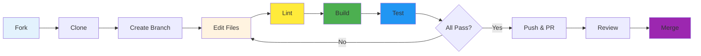

# Contributing Guide

How to contribute to the Goods Price Comparison API.

---

## Prerequisites

- Java 17+
- Maven 3.9+
- Spectral CLI (`brew install spectral-cli`)

---

## Contribution Workflow



---

## Quick Start

```bash
# Fork & clone
git clone https://github.com/YOUR_USERNAME/goods-price-comparison-api.git
cd goods-price-comparison-api

# Add upstream
git remote add upstream https://github.com/RizkiRachman/goods-price-comparison-api.git

# Build & test
make build
make test
```

---

## Where to Edit

| Change | Location |
|--------|----------|
| Endpoints | `src/main/resources/openapi/paths/*.yaml` |
| Data models | `src/main/resources/openapi/schemas/*.yaml` |
| API rules | `.spectral.yaml` |

**Never edit generated code** in `target/` or `src/main/java/`.

---

## Making Changes

1. **Edit** the appropriate OpenAPI files
2. **Lint** your changes:
   ```bash
   make lint
   ```
3. **Build** to verify:
   ```bash
   make build
   make test
   ```
4. **Check** all CI checks:
   ```bash
   make ci-check
   ```

---

## Submitting

1. Create branch: `git checkout -b feature/name`
2. Commit with [conventional format](https://conventionalcommits.org):
   ```
   feat(prices): Add pagination support
   fix(receipts): Correct response schema
   docs(readme): Update setup instructions
   ```
3. Push and create PR on GitHub

---

## Pre-PR Checklist

- [ ] `make lint` passes (0 Spectral errors)
- [ ] `make build` passes (Maven compile)
- [ ] `make test` passes (100%)
- [ ] Coverage ≥90% (100% for new code)
- [ ] Checkstyle passes
- [ ] SpotBugs passes (0 high priority)

---

## Code Style

| Type | Rule |
|------|------|
| Paths | kebab-case (`/price-search`) |
| operationId | camelCase (`searchPrices`) |
| All operations must have | Description, Tags, operationId, Responses |

---

## Testing

Tests focus on:
- Schema validation (generated DTOs are valid)
- JSON serialization
- Integration with service project

Run tests:
```bash
make test           # Local
make podman-test    # Container
```

---

**License:** MIT | Contact: rizkifaizalr@gmail.com
