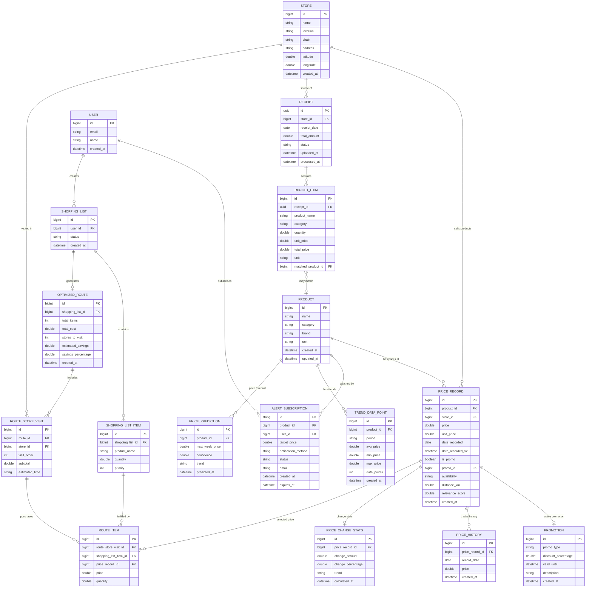

# Entity Relationship Diagram

## Goods Price Comparison API - Data Model

> Derived from OpenAPI 3.0.3 Specification and Generated DTOs

---

## Overview

This ERD represents the complete data model for the Goods Price Comparison API, mapping all OpenAPI schemas to database entities. The model supports:
- **Receipt OCR processing** with extracted line items
- **Price tracking** across multiple stores with historical data
- **Promotion management** with various discount types
- **Shopping route optimization** for multi-store purchases
- **Price alerts** with subscription management
- **Trend analysis** with aggregated statistics

---

## Entity Relationship Diagram (Mermaid)

---

## Core Domain Entities

### PRODUCT
Central product catalog with standardized product information.

| Field        | Type      | Example                       | Description         |
|--------------|-----------|-------------------------------|---------------------|
| `id`         | bigint PK | 1                             | Unique identifier   |
| `name`       | string    | "Ultra Milk Plain Slim 200ml" | Full product name   |
| `category`   | string    | "Dairy"                       | Product category    |
| `brand`      | string    | "Ultra Milk"                  | Product brand       |
| `unit`       | string    | "bottle"                      | Unit of measurement |
| `created_at` | datetime  | 2026-01-01T00:00:00Z          | Record creation     |
| `updated_at` | datetime  | 2026-03-29T10:00:00Z          | Last update         |

### STORE
Retail store information including geolocation data.

| Field        | Type      | Example               | Description          |
|--------------|-----------|-----------------------|----------------------|
| `id`         | bigint PK | 1                     | Unique identifier    |
| `name`       | string    | "DIAMOND"             | Store display name   |
| `location`   | string    | "Poins Square"        | Location/branch name |
| `chain`      | string    | "Diamond Supermarket" | Store chain brand    |
| `address`    | string    | -                     | Full address         |
| `latitude`   | double    | -6.2088               | GPS latitude         |
| `longitude`  | double    | 106.8456              | GPS longitude        |
| `created_at` | datetime  | -                     | Record creation      |

### PRICE_RECORD
Current price snapshot for a product at a specific store.

| Field              | Type      | Example              | Description               |
|--------------------|-----------|----------------------|---------------------------|
| `id`               | bigint PK | 1                    | Unique identifier         |
| `product_id`       | bigint FK | 1                    | → PRODUCT.id              |
| `store_id`         | bigint FK | 1                    | → STORE.id                |
| `price`            | double    | 5600.00              | Current price             |
| `unit_price`       | double    | 5600.00              | Price per unit            |
| `date_recorded`    | date      | 2026-03-29           | Date recorded (v1)        |
| `date_recorded_v2` | datetime  | 2026-03-29T14:30:00Z | Timestamp (v2)            |
| `is_promo`         | boolean   | false                | Promotional price flag    |
| `promo_id`         | bigint FK | null                 | → PROMOTION.id (optional) |
| `availability`     | enum      | in_stock             | Stock status enum         |
| `distance_km`      | double    | 2.5                  | Distance to store         |
| `relevance_score`  | double    | 0.95                 | Search relevance (0-1)    |
| `created_at`       | datetime  | -                    | Record creation           |

**Availability Enum Values:**
- `in_stock` - Product available
- `low_stock` - Limited availability  
- `out_of_stock` - Not available
- `unknown` - Status unknown

---

## Supporting Entities

### PROMOTION
Active promotions and discounts.

| Field                 | Type      | Example              | Description                |
|-----------------------|-----------|----------------------|----------------------------|
| `id`                  | bigint PK | 1                    | Unique identifier          |
| `promo_type`          | enum      | discount             | Promotion type             |
| `discount_percentage` | double    | 10.0                 | Discount % (if applicable) |
| `valid_until`         | datetime  | 2026-04-05T23:59:59Z | Promotion expiry           |
| `description`         | string    | -                    | Human-readable description |
| `created_at`          | datetime  | -                    | Record creation            |

**PromoType Enum Values:**
- `discount` - Percentage or fixed discount
- `bundle` - Multi-item bundle deal
- `buy_one_get_one` - BOGO offer
- `clearance` - Clearance sale

### PRICE_HISTORY
Historical price data points for trend analysis.

| Field             | Type      | Example    | Description          |
|-------------------|-----------|------------|----------------------|
| `id`              | bigint PK | 1          | Unique identifier    |
| `price_record_id` | bigint FK | 1          | → PRICE_RECORD.id    |
| `record_date`     | date      | 2026-03-01 | Date of price record |
| `price`           | double    | 5800.00    | Price on that date   |
| `created_at`      | datetime  | -          | Record creation      |

### PRICE_CHANGE_STATS
Calculated price change statistics (V2 feature).

| Field               | Type      | Example | Description                 |
|---------------------|-----------|---------|-----------------------------|
| `id`                | bigint PK | 1       | Unique identifier           |
| `price_record_id`   | bigint FK | 1       | → PRICE_RECORD.id           |
| `change_amount`     | double    | -200.00 | Price change from last week |
| `change_percentage` | double    | -3.45   | Percentage change           |
| `trend`             | enum      | falling | Trend direction             |
| `calculated_at`     | datetime  | -       | Calculation timestamp       |

**Trend Enum Values:** `rising`, `falling`, `stable`

---

## Receipt Processing Entities

### RECEIPT
OCR-processed receipt metadata with processing status.

| Field          | Type      | Example                              | Description           |
|----------------|-----------|--------------------------------------|-----------------------|
| `id`           | uuid PK   | 550e8400-e29b-41d4-a716-446655440000 | Unique job identifier |
| `store_id`     | bigint FK | 1                                    | → STORE.id (matched)  |
| `receipt_date` | date      | 2026-03-29                           | Date on receipt       |
| `total_amount` | double    | 1207206.00                           | Total receipt amount  |
| `status`       | enum      | COMPLETED                            | Processing status     |
| `uploaded_at`  | datetime  | -                                    | Upload timestamp      |
| `processed_at` | datetime  | -                                    | Completion timestamp  |

**Status Enum Values:** `PROCESSING`, `COMPLETED`, `FAILED`

### RECEIPT_ITEM
Individual line items extracted from receipt OCR.

| Field                | Type      | Example                       | Description               |
|----------------------|-----------|-------------------------------|---------------------------|
| `id`                 | bigint PK | 1                             | Unique identifier         |
| `receipt_id`         | uuid FK   | 550e8400...                   | → RECEIPT.id              |
| `product_name`       | string    | "Ultra Milk Plain Slim 200ml" | Extracted product name    |
| `category`           | string    | "Dairy"                       | Extracted category        |
| `quantity`           | double    | 48.0                          | Quantity purchased        |
| `unit_price`         | double    | 5600.00                       | Price per unit            |
| `total_price`        | double    | 268800.00                     | Line total                |
| `unit`               | string    | "bottle"                      | Unit of measurement       |
| `matched_product_id` | bigint FK | 1                             | → PRODUCT.id (if matched) |

---

## Alert & Notification Entities

### ALERT_SUBSCRIPTION
User subscriptions for price drop notifications.

| Field                 | Type      | Example          | Description            |
|-----------------------|-----------|------------------|------------------------|
| `id`                  | string PK | sub-12345        | Unique subscription ID |
| `product_id`          | bigint FK | 1                | → PRODUCT.id           |
| `user_id`             | bigint FK | 1                | → USER.id              |
| `target_price`        | double    | 5000.00          | Alert threshold price  |
| `notification_method` | enum      | email            | Delivery method        |
| `status`              | enum      | ACTIVE           | Subscription status    |
| `email`               | string    | user@example.com | Notification email     |
| `created_at`          | datetime  | -                | Subscription creation  |
| `expires_at`          | datetime  | -                | Optional expiry date   |

**NotificationMethod Enum:** `email`, `push`, `sms`
**Status Enum:** `ACTIVE`, `PAUSED`, `EXPIRED`

### PRICE_PREDICTION
ML-generated price predictions (V2 feature).

| Field             | Type      | Example | Description                 |
|-------------------|-----------|---------|-----------------------------|
| `id`              | bigint PK | 1       | Unique identifier           |
| `product_id`      | bigint FK | 1       | → PRODUCT.id                |
| `next_week_price` | double    | 5300.00 | Predicted price             |
| `confidence`      | double    | 0.85    | Prediction confidence (0-1) |
| `trend`           | enum      | falling | Predicted trend             |
| `predicted_at`    | datetime  | -       | Prediction timestamp        |

---

## Shopping Route Optimization Entities

### SHOPPING_LIST
User-created shopping lists.

| Field        | Type      | Example   | Description        |
|--------------|-----------|-----------|--------------------|
| `id`         | bigint PK | 1         | Unique identifier  |
| `user_id`    | bigint FK | 1         | → USER.id          |
| `status`     | enum      | optimized | List status        |
| `created_at` | datetime  | -         | Creation timestamp |

### SHOPPING_LIST_ITEM
Items within a shopping list.

| Field              | Type      | Example                       | Description        |
|--------------------|-----------|-------------------------------|--------------------|
| `id`               | bigint PK | 1                             | Unique identifier  |
| `shopping_list_id` | bigint FK | 1                             | → SHOPPING_LIST.id |
| `product_name`     | string    | "Ultra Milk Plain Slim 200ml" | Item name          |
| `quantity`         | double    | 1.0                           | Desired quantity   |
| `priority`         | int       | 1                             | Priority order     |

### OPTIMIZED_ROUTE
Generated optimal shopping route for a list.

| Field                | Type      | Example   | Description             |
|----------------------|-----------|-----------|-------------------------|
| `id`                 | bigint PK | 1         | Unique identifier       |
| `shopping_list_id`   | bigint FK | 1         | → SHOPPING_LIST.id      |
| `total_items`        | int       | 5         | Total items in route    |
| `total_cost`         | double    | 375200.00 | Estimated total cost    |
| `stores_to_visit`    | int       | 2         | Number of stores        |
| `estimated_savings`  | double    | 45200.00  | Savings vs single store |
| `savings_percentage` | double    | 10.7      | Savings percentage      |
| `created_at`         | datetime  | -         | Route generation time   |

### ROUTE_STORE_VISIT
Store visit within an optimized route.

| Field            | Type      | Example   | Description          |
|------------------|-----------|-----------|----------------------|
| `id`             | bigint PK | 1         | Unique identifier    |
| `route_id`       | bigint FK | 1         | → OPTIMIZED_ROUTE.id |
| `store_id`       | bigint FK | 3         | → STORE.id           |
| `visit_order`    | int       | 1         | Sequence in route    |
| `subtotal`       | double    | 94900.00  | Cost at this store   |
| `estimated_time` | string    | "15 mins" | Time estimate        |

### ROUTE_ITEM
Individual purchase item at a specific store visit.

| Field                   | Type      | Example | Description                        |
|-------------------------|-----------|---------|------------------------------------|
| `id`                    | bigint PK | 1       | Unique identifier                  |
| `route_store_visit_id`  | bigint FK | 1       | → ROUTE_STORE_VISIT.id             |
| `shopping_list_item_id` | bigint FK | 1       | → SHOPPING_LIST_ITEM.id            |
| `price_record_id`       | bigint FK | 1       | → PRICE_RECORD.id (selected price) |
| `price`                 | double    | 5400.00 | Price at this store                |
| `quantity`              | double    | 1.0     | Quantity to purchase               |

---

## Analytics Entities

### TREND_DATA_POINT
Aggregated price trend statistics by time period.

| Field         | Type      | Example      | Description              |
|---------------|-----------|--------------|--------------------------|
| `id`          | bigint PK | 1            | Unique identifier        |
| `product_id`  | bigint FK | 1            | → PRODUCT.id             |
| `period`      | string    | "2026-01-01" | Time period (date/month) |
| `avg_price`   | double    | 5800.00      | Average price in period  |
| `min_price`   | double    | 5600.00      | Minimum price in period  |
| `max_price`   | double    | 6000.00      | Maximum price in period  |
| `data_points` | int       | 5            | Number of price records  |
| `created_at`  | datetime  | -            | Record creation          |

### USER
User account information.

| Field        | Type      | Description        |
|--------------|-----------|--------------------|
| `id`         | bigint PK | Unique identifier  |
| `email`      | string    | User email address |
| `name`       | string    | User display name  |
| `created_at` | datetime  | Account creation   |

---

## Schema to DTO Mapping

| OpenAPI Schema | Java DTO | Database Entity | Notes |
|----------------|----------|-----------------|-------|
| `ReceiptItem` | `ReceiptItem.java` | RECEIPT_ITEM | OCR extracted line items |
| `PriceResult` | `PriceResult.java` | PRICE_RECORD (v1 view) | Basic price info |
| `PriceResultV2` | `PriceResultV2.java` | PRICE_RECORD + nested | Enhanced with promo, history, stats |
| `PriceResultV2PromoDetails` | `PriceResultV2PromoDetails.java` | PROMOTION | Promotion metadata |
| `PriceResultV2PriceHistoryInner` | `PriceResultV2PriceHistoryInner.java` | PRICE_HISTORY | Historical data points |
| `PriceResultV2PriceChange` | `PriceResultV2PriceChange.java` | PRICE_CHANGE_STATS | Calculated changes |
| `CheapestPrice` | `CheapestPrice.java` | Derived view | MIN aggregation of PRICE_RECORD |
| `StoreVisit` | `StoreVisit.java` | ROUTE_STORE_VISIT | Route segment |
| `ShoppingItem` | `ShoppingItem.java` | ROUTE_ITEM | Purchase item in route |
| `ShoppingSavings` | `ShoppingSavings.java` | OPTIMIZED_ROUTE fields | Savings calculation |
| `TrendDataPoint` | `TrendDataPoint.java` | TREND_DATA_POINT | Aggregated statistics |
| `AlertSubscriptionRequest` | `AlertSubscriptionRequest.java` | ALERT_SUBSCRIPTION (input) | Subscription creation |
| `AlertSubscriptionResponse` | `AlertSubscriptionResponse.java` | ALERT_SUBSCRIPTION (output) | Subscription status |
| `PriceSearchResponseV2Predictions` | `PriceSearchResponseV2Predictions.java` | PRICE_PREDICTION | ML predictions |
| `PriceSearchResponseV2Pagination` | `PriceSearchResponseV2Pagination.java` | Query metadata | Runtime pagination |
| `ShoppingPreferences` | `ShoppingPreferences.java` | Runtime config | Route optimization prefs |
| `DateRange` | `DateRange.java` | Query parameter | Date filtering |

---

## Key Relationships Summary

| Relationship | Cardinality | Business Meaning |
|--------------|-------------|------------------|
| PRODUCT → PRICE_RECORD | 1:N | Product sold at multiple stores with different prices |
| STORE → PRICE_RECORD | 1:N | Store offers multiple products |
| PRICE_RECORD → PROMOTION | N:0..1 | Optional promotion on a price |
| PRICE_RECORD → PRICE_HISTORY | 1:N | Historical price tracking over time |
| RECEIPT → RECEIPT_ITEM | 1:N | Receipt contains multiple line items |
| PRODUCT → ALERT_SUBSCRIPTION | 1:N | Multiple users can watch same product |
| USER → ALERT_SUBSCRIPTION | 1:N | User can have multiple price alerts |
| SHOPPING_LIST → OPTIMIZED_ROUTE | 1:0..1 | One optimized route per list |
| OPTIMIZED_ROUTE → ROUTE_STORE_VISIT | 1:N | Route visits multiple stores |
| ROUTE_STORE_VISIT → ROUTE_ITEM | 1:N | Each store visit has multiple items |

---

## Indexes Recommendations

| Table | Column(s) | Type | Purpose |
|-------|-----------|------|---------|
| PRICE_RECORD | (product_id, store_id, date_recorded) | Composite | Price lookups |
| PRICE_RECORD | (store_id, is_promo) | Composite | Promotion queries |
| PRICE_HISTORY | (price_record_id, record_date) | Composite | Trend analysis |
| RECEIPT_ITEM | (receipt_id) | Foreign key | Receipt loading |
| ALERT_SUBSCRIPTION | (product_id, status) | Composite | Alert processing |
| TREND_DATA_POINT | (product_id, period) | Composite | Trend queries |
