# High-Traffic Optimized Database Schema

## Goods Price Comparison API - High Performance Data Model

> **Design Goals:** 
> - Handle 10K+ req/sec read traffic
> - 1K+ price updates/sec write throughput  
> - Sub-50ms P99 read latency
> - CQRS + Event Sourcing + Sharding + Partitioning

---

## Architecture Overview

```
┌─────────────────────────────────────────────────────────────────┐
│                         API Layer                               │
└─────────────────────────────────────────────────────────────────┘
                              │
        ┌─────────────────────┼─────────────────────┐
        │                     │                     │
┌───────▼──────┐    ┌─────────▼──────────┐  ┌──────▼──────┐
│  Read API    │    │   Write API        │  │   Cache     │
│  (Read DB)   │    │   (Command DB)     │  │  (Redis)    │
└──────────────┘    └────────────────────┘  └─────────────┘
        │                     │
        │            ┌────────▼─────────┐
        │            │   Event Store    │
        │            │  (Kafka/Pulsar)  │
        │            └────────┬─────────┘
        │                     │
┌───────▼─────────────────────▼────────────────────────────────┐
│                    Read Replica Pool                        │
│  ┌────────────┐  ┌────────────┐  ┌────────────┐          │
│  │  Replica 1 │  │  Replica 2 │  │  Replica N │          │
│  └────────────┘  └────────────┘  └────────────┘          │
└────────────────────────────────────────────────────────────┘
                              │
┌─────────────────────────────▼──────────────────────────────┐
│                    Write/Primary DB                          │
│              (Partitioned + Sharded)                         │
└──────────────────────────────────────────────────────────────┘
```

---

## High-Traffic ERD (CQRS + Event Sourcing)

```mermaid
erDiagram
    PRICE_EVENTS {
        bigint id PK
        uuid event_id UK
        bigint product_id
        bigint store_id
        smallint event_type
        jsonb payload
        bigint sequence_number
        timestamp occurred_at
        uuid correlation_id
    }

    PRICE_EVENT_TYPES {
        smallint id PK
        string code
        string description
    }

    PRICE_COMMAND_LOG {
        bigint id PK
        uuid command_id UK
        bigint product_id
        bigint store_id
        smallint command_type
        jsonb payload
        smallint status
        string error_message
        timestamp created_at
        timestamp processed_at
    }

    COMMAND_STATUS {
        smallint id PK
        string code
    }

    COMMAND_TYPES {
        smallint id PK
        string code
    }

    PRICE_AGGREGATE_SNAPSHOT {
        bigint id PK
        bigint product_id
        bigint store_id
        jsonb current_state
        bigint last_event_sequence
        timestamp snapshot_at
        int version
    }

    PRICE_CURRENT_MV {
        bigint id PK
        bigint product_id
        bigint store_id
        decimal price
        decimal unit_price
        boolean is_promo
        bigint promotion_id
        smallint availability_id
        decimal relevance_score
        timestamp last_updated
        int version
    }

    PRICE_HISTORY_PARTITIONED {
        bigint id PK
        bigint product_id
        bigint store_id
        date record_date
        decimal price
        int partition_key
    }

    PRICE_TREND_MV {
        bigint id PK
        bigint product_id
        date trend_date
        decimal avg_price
        decimal min_price
        decimal max_price
        int data_points
        smallint trend_direction_id
        timestamp materialized_at
    }

    CHEAPEST_PRICE_MV {
        bigint id PK
        bigint product_id
        bigint cheapest_store_id
        decimal cheapest_price
        bigint reference_store_id
        decimal reference_price
        decimal savings_amount
        timestamp calculated_at
    }

    PRODUCT_DIM {
        bigint id PK
        string name
        smallint category_id FK
        smallint brand_id FK
        smallint unit_id FK
        jsonb search_terms
        timestamp created_at
    }

    STORE_DIM {
        bigint id PK
        string name
        string location
        smallint chain_id FK
        decimal latitude
        decimal longitude
        smallint region_id FK
        timestamp created_at
    }

    REGION {
        smallint id PK
        string code
        string name
        int shard_assignment
    }

    PROMOTION_DIM {
        bigint id PK
        smallint type_id FK
        decimal discount_percentage
        datetime valid_until
        bigint store_id FK
    }

    AVAILABILITY_STATUS {
        smallint id PK
        string code
    }

    TREND_DIRECTION {
        smallint id PK
        string code
    }

    CACHE_WARM_TABLE {
        string cache_key PK
        jsonb cached_value
        timestamp cached_at
        timestamp expires_at
        int hit_count
        timestamp last_accessed
    }

    CACHE_INVALIDATION_LOG {
        bigint id PK
        string cache_key
        string invalidation_reason
        timestamp invalidated_at
        uuid triggered_by_event
    }

    RECEIPT_UPLOAD_QUEUE {
        uuid id PK
        string storage_path
        smallint priority
        smallint status
        timestamp uploaded_at
        timestamp processing_started_at
        timestamp completed_at
        int retry_count
        string error_message
    }

    RECEIPT_LINE_ITEM_RAW {
        bigint id PK
        uuid receipt_id
        string extracted_text
        jsonb ocr_confidence_scores
        int retry_parsing_count
        timestamp extracted_at
    }

    ALERT_NOTIFICATION_QUEUE {
        bigint id PK
        string subscription_id
        bigint product_id
        decimal triggered_price
        decimal target_price
        smallint status
        timestamp queued_at
        timestamp processed_at
    }

    ROUTE_CALCULATION_QUEUE {
        bigint id PK
        bigint shopping_list_id
        bigint user_id
        jsonb preferences
        smallint status
        timestamp queued_at
        timestamp calculated_at
    }

    PRICE_CHANGES_TS {
        timestamp occurred_at PK
        bigint product_id PK
        bigint store_id PK
        decimal old_price
        decimal new_price
        decimal change_pct
        uuid event_id
    }

    SEARCH_QUERIES_LOG {
        timestamp searched_at PK
        string query_hash PK
        string query_text
        bigint user_id
        int result_count
        int response_time_ms
        jsonb filters_applied
    }

    API_METRICS_TS {
        timestamp measured_at PK
        string endpoint PK
        string method PK
        int request_count
        int error_count
        decimal avg_response_ms
        decimal p50_response_ms
        decimal p95_response_ms
        decimal p99_response_ms
    }

    PRICE_EVENTS ||--o{ PRICE_AGGREGATE_SNAPSHOT : "produces"
    PRICE_EVENT_TYPES ||--o{ PRICE_EVENTS : "types"
    PRICE_COMMAND_LOG ||--o| PRICE_EVENTS : "generates"
    COMMAND_TYPES ||--o{ PRICE_COMMAND_LOG : "commands"
    COMMAND_STATUS ||--o{ PRICE_COMMAND_LOG : "status"
    PRICE_EVENTS ||--o{ PRICE_CURRENT_MV : "projects to"
    PRICE_EVENTS ||--o{ PRICE_HISTORY_PARTITIONED : "projects to"
    PRICE_EVENTS ||--o{ PRICE_TREND_MV : "triggers update"
    PRICE_EVENTS ||--o{ CHEAPEST_PRICE_MV : "triggers update"
    PRODUCT_DIM ||--o{ PRICE_EVENTS : "subject of"
    STORE_DIM ||--o{ PRICE_EVENTS : "at location"
    REGION ||--o{ STORE_DIM : "contains"
    PRODUCT_DIM ||--o{ PRICE_CURRENT_MV : "current price"
    STORE_DIM ||--o{ PRICE_CURRENT_MV : "sells at"
    PROMOTION_DIM ||--o{ PRICE_CURRENT_MV : "promotional"
    AVAILABILITY_STATUS ||--o{ PRICE_CURRENT_MV : "availability"
    PRODUCT_DIM ||--o{ PRICE_HISTORY_PARTITIONED : "history"
    STORE_DIM ||--o{ PRICE_HISTORY_PARTITIONED : "at store"
    PRODUCT_DIM ||--o{ PRICE_TREND_MV : "trends"
    TREND_DIRECTION ||--o{ PRICE_TREND_MV : "direction"
    PRODUCT_DIM ||--o{ CHEAPEST_PRICE_MV : "cheapest at"
    STORE_DIM ||--o{ CHEAPEST_PRICE_MV : "store"
    PRICE_EVENTS ||--o{ CACHE_INVALIDATION_LOG : "invalidates"
    CACHE_INVALIDATION_LOG ||--o{ CACHE_WARM_TABLE : "clears"
    RECEIPT_UPLOAD_QUEUE ||--o{ RECEIPT_LINE_ITEM_RAW : "produces"
    PRICE_CHANGES_TS ||--|| PRICE_EVENTS : "analytics mirror"
```



---

## Command Side (Write Model) - Event Sourcing

### PRICE_EVENTS (Event Store)
> **Sharding:** By `product_id`  
> **Partitioning:** By `occurred_at` (monthly)  
> **Estimated Size:** 1B+ events/year

| Field             | Type                            | Description                     |
|-------------------|---------------------------------|---------------------------------|
| `id`              | bigint PK                       | Surrogate key (BIGSERIAL)       |
| `event_id`        | uuid UK                         | Unique event identifier         |
| `product_id`      | bigint                          | Sharding key                    |
| `store_id`        | bigint                          | Store reference                 |
| `event_type`      | smallint FK → PRICE_EVENT_TYPES | Type of price event             |
| `payload`         | jsonb                           | Event data (flexible schema)    |
| `sequence_number` | bigint                          | Per-aggregate sequence          |
| `occurred_at`     | timestamp                       | Event timestamp (partition key) |
| `correlation_id`  | uuid                            | Distributed tracing             |

**Indexes:**
```sql
-- Primary lookup by aggregate
CREATE INDEX idx_price_events_aggregate 
ON price_events(product_id, store_id, sequence_number);

-- Event type filtering
CREATE INDEX idx_price_events_type_occurred 
ON price_events(event_type, occurred_at DESC);

-- Correlation tracing
CREATE INDEX idx_price_events_correlation 
ON price_events(correlation_id);
```

**Sharding Strategy:**
```sql
-- Shard by product_id % 64 (64 shards)
-- Each shard handles ~16M products
-- Enables horizontal write scaling
```

### PRICE_EVENT_TYPES

| ID | Code | Description |
|----|------|-------------|
| 1 | PRICE_CREATED | Initial price set |
| 2 | PRICE_UPDATED | Price changed |
| 3 | PROMOTION_APPLIED | Promotion added |
| 4 | PROMOTION_ENDED | Promotion removed |
| 5 | AVAILABILITY_CHANGED | Stock status update |
| 6 | PRICE_PREDICTED | ML prediction generated |

### PRICE_COMMAND_LOG (Command Audit)
Tracks all incoming commands for replay/debugging.

| Field          | Type      | Description                 |
|----------------|-----------|-----------------------------|
| `command_id`   | uuid UK   | Unique command ID           |
| `product_id`   | bigint    | Target product              |
| `store_id`     | bigint    | Target store                |
| `command_type` | smallint  | Update/Create/Delete        |
| `status`       | smallint  | Processing/Completed/Failed |
| `processed_at` | timestamp | Completion time             |

### PRICE_AGGREGATE_SNAPSHOT (Performance Optimization)
> **Purpose:** Avoid replaying all events for current state  
> **Frequency:** Snapshot every 100 events per aggregate

| Field                 | Type      | Description                |
|-----------------------|-----------|----------------------------|
| `product_id`          | bigint PK | Aggregate ID (part 1)      |
| `store_id`            | bigint PK | Aggregate ID (part 2)      |
| `current_state`       | jsonb     | Serialized aggregate state |
| `last_event_sequence` | bigint    | Last included event        |
| `snapshot_at`         | timestamp | When created               |
| `version`             | int       | Optimistic lock version    |

---

## Query Side (Read Model) - Materialized Views

### PRICE_CURRENT_MV (Hot Data)
> **Access Pattern:** 95% of reads hit this table  
> **Strategy:** In-memory + Read replicas + Aggressive caching  
> **Update Strategy:** Event-driven projection

| Field             | Type          | Description            |
|-------------------|---------------|------------------------|
| `id`              | bigint PK     | Surrogate key          |
| `product_id`      | bigint        | → PRODUCT_DIM.id       |
| `store_id`        | bigint        | → STORE_DIM.id         |
| `price`           | decimal(12,2) | Current price          |
| `unit_price`      | decimal(12,2) | Price per unit         |
| `is_promo`        | boolean       | Promotion flag         |
| `promotion_id`    | bigint        | → PROMOTION_DIM.id     |
| `availability_id` | smallint      | Stock status           |
| `relevance_score` | decimal(3,2)  | 0-1 search score       |
| `last_updated`    | timestamp     | From event timestamp   |
| `version`         | int           | For optimistic locking |

**High-Traffic Optimizations:**
```sql
-- Covering index for price search
CREATE INDEX idx_price_current_search 
ON price_current_mv(product_id, price, store_id, availability_id)
INCLUDE (unit_price, is_promo, relevance_score);

-- Hot data pinning (PostgreSQL)
ALTER TABLE price_current_mv SET (fillfactor = 100);

-- Read replica setup
-- Primary: Writes only
-- Replica 1-5: Read queries load balanced
```

**Caching Strategy:**
```
L1: Application cache (Caffeine) - 10K entries, 5min TTL
L2: Redis Cluster - 5min TTL with pub/sub invalidation
L3: Read Replica DB - Final source of truth
Cache Key: price:current:{product_id}:{store_id}
```

### PRICE_HISTORY_PARTITIONED (Time-Series)
> **Partitions:** 100 hash partitions × monthly time partitions  
> **Retention:** Auto-archive after 2 years

| Field           | Type          | Description            |
|-----------------|---------------|------------------------|
| `id`            | bigint PK     | Surrogate              |
| `product_id`    | bigint        | Sharding key           |
| `store_id`      | bigint        | Store                  |
| `record_date`   | date          | Partition key          |
| `price`         | decimal(12,2) | Historical price       |
| `partition_key` | int           | HASH(product_id) % 100 |

**Partitioning DDL:**
```sql
-- PostgreSQL 14+ declarative partitioning
CREATE TABLE price_history_partitioned (
    id bigint,
    product_id bigint,
    store_id bigint,
    record_date date,
    price decimal(12,2),
    partition_key int GENERATED ALWAYS AS (hashtext(product_id::text) % 100) STORED,
    PRIMARY KEY (id, partition_key, record_date)
) PARTITION BY RANGE (record_date);

-- Create monthly partitions
CREATE TABLE price_history_y2026m01 
    PARTITION OF price_history_partitioned
    FOR VALUES FROM ('2026-01-01') TO ('2026-02-01');
```

### CHEAPEST_PRICE_MV (Pre-calculated Aggregates)
> **Update Frequency:** Every 5 minutes via background job  
> **Use Case:** "Find cheapest store" API endpoint

| Field                | Type          | Description              |
|----------------------|---------------|--------------------------|
| `product_id`         | bigint PK     | Product                  |
| `cheapest_store_id`  | bigint        | Store with lowest price  |
| `cheapest_price`     | decimal(12,2) | Lowest price found       |
| `reference_store_id` | bigint        | User's preferred store   |
| `reference_price`    | decimal(12,2) | Price at reference store |
| `savings_amount`     | decimal(12,2) | Calculated savings       |
| `calculated_at`      | timestamp     | When computed            |

---

## Cache Layer Design

### CACHE_WARM_TABLE (DB-Backed Cache)
> **Purpose:** Survive Redis failures, warm cache on restart

| Field           | Type            | Description          |
|-----------------|-----------------|----------------------|
| `cache_key`     | varchar(255) PK | Redis-compatible key |
| `cached_value`  | jsonb           | Serialized data      |
| `cached_at`     | timestamp       | Creation time        |
| `expires_at`    | timestamp       | TTL expiration       |
| `hit_count`     | int             | Access frequency     |
| `last_accessed` | timestamp       | LRU tracking         |

**Cache Warming Query:**
```sql
-- Pre-load hot products into cache
INSERT INTO cache_warm_table (cache_key, cached_value, expires_at)
SELECT 
    'price:current:' || product_id || ':' || store_id,
    jsonb_build_object(
        'price', price,
        'store_id', store_id,
        'is_promo', is_promo
    ),
    NOW() + INTERVAL '5 minutes'
FROM price_current_mv
WHERE product_id IN (
    SELECT product_id FROM search_queries_log 
    WHERE searched_at > NOW() - INTERVAL '1 hour'
    GROUP BY product_id
    ORDER BY COUNT(*) DESC
    LIMIT 10000
);
```

### CACHE_INVALIDATION_LOG (Event-Driven Invalidation)
Tracks cache invalidation events for distributed cache consistency.

| Field                 | Type         | Description       |
|-----------------------|--------------|-------------------|
| `cache_key`           | varchar(255) | Key to invalidate |
| `invalidation_reason` | varchar(50)  | Why invalidated   |
| `triggered_by_event`  | uuid         | Source event ID   |
| `invalidated_at`      | timestamp    | When triggered    |

**Invalidation Strategy:**
```
1. Event written to PRICE_EVENTS
2. Projection updates PRICE_CURRENT_MV
3. Cache invalidation event written to log
4. Redis pub/sub broadcasts invalidation
5. All nodes evict from local cache
6. Next read fetches from DB and re-populates cache
```

---

## Async Processing Queues

### RECEIPT_UPLOAD_QUEUE (OCR Pipeline)
| Field         | Type     | Purpose                                |
|---------------|----------|----------------------------------------|
| `priority`    | smallint | 1=urgent, 10=batch                     |
| `status`      | smallint | QUEUED/PROCESSING/COMPLETED/FAILED     |
| `retry_count` | int      | Max 3 retries with exponential backoff |

**Processing Flow:**
```
Upload → Queue → OCR Worker → Parse → Store Results
                    ↓
            Dead Letter Queue (after 3 failures)
```

### ALERT_NOTIFICATION_QUEUE (Price Drop Alerts)
| Field             | Type     | Purpose                    |
|-------------------|----------|----------------------------|
| `triggered_price` | decimal  | Price that triggered alert |
| `target_price`    | decimal  | User's target threshold    |
| `status`          | smallint | QUEUED/SENT/FAILED         |

**Batching Strategy:**
```
- Accumulate alerts for 1 minute
- Group by notification_method
- Send batch notifications (reduces API calls)
- Rate limiting: 100 notifications/sec per user
```

---

## Sharding Strategy

### Product-Based Sharding
```
Shard Count: 64
Shard Key: product_id % 64
Rationale: Even distribution, product-centric queries stay on one shard

Shard Router:
- product_id 1-1000000 → Shard 1
- product_id 1000001-2000000 → Shard 2
- etc.
```

### Cross-Shard Operations
```sql
-- Fan-out query (parallel execution)
SELECT * FROM price_current_mv 
WHERE product_id IN (1, 2, 3)  -- Different shards
→ Execute on Shard 1, Shard 2, Shard 3 in parallel
→ Aggregate results in application layer
```

### Hot Spot Mitigation
```
Problem: Popular products (e.g., milk) hit same shard heavily
Solution: Cache hot products in separate cache cluster
         Bypass database for top 1000 products
```

---

## Connection Pool Configuration

### Read Replicas (5 nodes)
```yaml
pool:
  min_size: 10
  max_size: 100
  max_overflow: 20
  timeout: 30s
  recycle: 3600s
  
load_balancer:
  strategy: round_robin
  health_check: every 10s
  failover: automatic
```

### Write Primary
```yaml
pool:
  min_size: 5
  max_size: 30
  # Smaller pool due to faster write operations
  # Event sourcing = append-only = no contention
```

---

## Performance Benchmarks (Target)

| Metric | Target | Strategy |
|--------|--------|----------|
| P99 Read Latency | < 50ms | L1/L2 caching + read replicas |
| P99 Write Latency | < 100ms | Event append-only + async projection |
| Throughput (Reads) | 50K req/sec | 5 read replicas × 10K each |
| Throughput (Writes) | 5K events/sec | Sharded event store |
| Cache Hit Rate | > 95% | Warm cache + predictive pre-loading |
| Price History Query | < 200ms | Partition pruning + indexes |

---

## Query Patterns & Optimizations

### Pattern 1: Price Search (Most Common)
```sql
-- Query reads from materialized view
SELECT p.*, s.name as store_name, s.location
FROM price_current_mv p
JOIN store_dim s ON p.store_id = s.id
WHERE p.product_id = :product_id
  AND p.availability_id = 1  -- in_stock
ORDER BY p.price ASC
LIMIT 20;

-- Execution: Index scan + join, ~5ms
-- Cache: Result cached for 5 minutes
```

### Pattern 2: Price History Range
```sql
-- Partition pruning eliminates 99% of data
SELECT record_date, price
FROM price_history_partitioned
WHERE product_id = :product_id
  AND store_id = :store_id
  AND record_date BETWEEN :start AND :end
ORDER BY record_date;

-- Execution: Only scans 1-2 partitions
```

### Pattern 3: Cheapest Store
```sql
-- Pre-calculated materialized view
SELECT * FROM cheapest_price_mv
WHERE product_id = :product_id;

-- Execution: Single row lookup, ~1ms
```
