# Normalized Entity Relationship Diagram (3NF)

## Goods Price Comparison API - Normalized Data Model

> **Database Design Principle:** Third Normal Form (3NF)  
> **Goals:** Eliminate redundancy, ensure referential integrity, optimize for OLTP

---

## Normalization Summary

| Original Entity | Normalization Action | Result |
|-----------------|---------------------|--------|
| `PRODUCT.category` | Extract to lookup table | `CATEGORY` table with FK |
| `STORE.chain` | Extract to lookup table | `STORE_CHAIN` table with FK |
| `PRICE_RECORD` | Split temporal data | `PRICE_HISTORY`, `PRICE_SNAPSHOT` |
| `Enum fields` | Create lookup tables | `PROMOTION_TYPE`, `AVAILABILITY_STATUS`, etc. |
| `PRODUCT.brand` | Extract if high cardinality | `BRAND` table with FK |
| `RECEIPT.status` | Create status lookup | `RECEIPT_STATUS` |

---

## Normalized Entity Relationship Diagram

```mermaid
erDiagram
    CATEGORY {
        smallint id PK
        string name
        string description
        datetime created_at
    }

    BRAND {
        smallint id PK
        string name
        string description
        datetime created_at
    }

    UNIT_OF_MEASURE {
        smallint id PK
        string code
        string name
        string description
        datetime created_at
    }

    STORE_CHAIN {
        smallint id PK
        string name
        string description
        datetime created_at
    }

    PROMOTION_TYPE {
        tinyint id PK
        string code
        string name
        string description
    }

    AVAILABILITY_STATUS {
        tinyint id PK
        string code
        string name
        string description
    }

    TREND_DIRECTION {
        tinyint id PK
        string code
        string name
    }

    NOTIFICATION_METHOD {
        tinyint id PK
        string code
        string name
    }

    SUBSCRIPTION_STATUS {
        tinyint id PK
        string code
        string name
    }

    RECEIPT_STATUS {
        tinyint id PK
        string code
        string name
    }

    OCR_JOB_STATUS {
        tinyint id PK
        string code
        string name
    }

    PRODUCT {
        bigint id PK
        string name
        smallint category_id FK
        smallint brand_id FK
        smallint unit_id FK
        datetime created_at
        datetime updated_at
    }

    STORE {
        bigint id PK
        string name
        string location
        smallint chain_id FK
        string address
        decimal latitude
        decimal longitude
        datetime created_at
    }

    PRICE_SNAPSHOT {
        bigint id PK
        bigint product_id FK
        bigint store_id FK
        decimal price
        decimal unit_price
        datetime recorded_at
        boolean is_promo
        bigint promotion_id FK
        tinyint availability_id FK
        decimal relevance_score
        datetime created_at
    }

    PROMOTION {
        bigint id PK
        tinyint type_id FK
        decimal discount_percentage
        datetime valid_from
        datetime valid_until
        string description
        bigint store_id FK
        datetime created_at
    }

    PRICE_HISTORY_EVENT {
        bigint id PK
        bigint price_snapshot_id FK
        date record_date
        decimal price
        datetime created_at
    }

    PRICE_CHANGE_ANALYTICS {
        bigint id PK
        bigint product_id FK
        bigint store_id FK
        decimal change_amount
        decimal change_percentage
        tinyint trend_id FK
        date calculated_for_date
        datetime calculated_at
    }

    PRICE_PREDICTION {
        bigint id PK
        bigint product_id FK
        bigint store_id FK
        decimal predicted_price
        decimal confidence
        tinyint trend_id FK
        date prediction_for_date
        datetime predicted_at
    }

    OCR_JOB {
        uuid id PK
        tinyint status_id FK
        string original_filename
        string storage_path
        int file_size_bytes
        datetime uploaded_at
        datetime processing_started_at
        datetime processing_completed_at
        int progress_percent
        string error_message
    }

    RECEIPT {
        uuid id PK
        uuid ocr_job_id FK
        bigint store_id FK
        date receipt_date
        decimal total_amount
        tinyint status_id FK
        datetime extracted_at
    }

    RECEIPT_LINE_ITEM {
        bigint id PK
        uuid receipt_id FK
        bigint matched_product_id FK
        string extracted_product_name
        string extracted_category
        decimal quantity
        decimal unit_price
        decimal total_price
        smallint unit_id FK
        decimal confidence_score
    }

    USER_ACCOUNT {
        bigint id PK
        string email
        string password_hash
        string name
        boolean is_active
        datetime created_at
        datetime updated_at
    }

    ALERT_SUBSCRIPTION {
        string id PK
        bigint user_id FK
        bigint product_id FK
        bigint store_id FK
        decimal target_price
        tinyint notification_method_id FK
        tinyint status_id FK
        datetime created_at
        datetime expires_at
        datetime triggered_at
    }

    SHOPPING_LIST {
        bigint id PK
        bigint user_id FK
        string name
        datetime created_at
        datetime optimized_at
    }

    SHOPPING_LIST_ENTRY {
        bigint id PK
        bigint list_id FK
        bigint product_id FK
        string product_name_input
        decimal quantity
        int priority
        boolean is_resolved
        bigint matched_product_id FK
    }

    OPTIMIZED_ROUTE {
        bigint id PK
        bigint list_id FK
        int total_items
        decimal total_cost
        int stores_to_visit
        decimal estimated_savings
        decimal savings_percentage
        datetime optimized_at
    }

    ROUTE_STOP {
        bigint id PK
        bigint route_id FK
        bigint store_id FK
        int stop_order
        decimal subtotal
        int estimated_minutes
    }

    ROUTE_STOP_ITEM {
        bigint id PK
        bigint route_stop_id FK
        bigint list_entry_id FK
        bigint price_snapshot_id FK
        decimal price_at_time
        decimal quantity
        decimal line_total
    }

    PRODUCT_TREND_PERIOD {
        bigint id PK
        bigint product_id FK
        date period_start
        date period_end
        string granularity
        decimal avg_price
        decimal min_price
        decimal max_price
        int data_points
        tinyint overall_trend_id FK
        datetime calculated_at
    }

    PRODUCT_STORE_AVAILABILITY {
        bigint id PK
        bigint product_id FK
        bigint store_id FK
        tinyint availability_id FK
        datetime first_seen_at
        datetime last_seen_at
        datetime updated_at
    }

    STORE_DISTANCE_CACHE {
        bigint id PK
        bigint from_store_id FK
        bigint to_store_id FK
        decimal distance_km
        decimal estimated_travel_minutes
        datetime calculated_at
    }

    CATEGORY ||--o{ PRODUCT : "categorizes"
    BRAND ||--o{ PRODUCT : "owns"
    UNIT_OF_MEASURE ||--o{ PRODUCT : "measures"
    UNIT_OF_MEASURE ||--o{ RECEIPT_LINE_ITEM : "measures"
    STORE_CHAIN ||--o{ STORE : "operates"
    PRODUCT ||--o{ PRICE_SNAPSHOT : "priced at"
    STORE ||--o{ PRICE_SNAPSHOT : "sells"
    PRICE_SNAPSHOT ||--o| PROMOTION : "discounted by"
    PROMOTION_TYPE ||--o{ PROMOTION : "types"
    AVAILABILITY_STATUS ||--o{ PRICE_SNAPSHOT : "availability"
    PRICE_SNAPSHOT ||--o{ PRICE_HISTORY_EVENT : "evolves to"
    PRODUCT ||--o{ PRICE_CHANGE_ANALYTICS : "tracked in"
    STORE ||--o{ PRICE_CHANGE_ANALYTICS : "tracked at"
    TREND_DIRECTION ||--o{ PRICE_CHANGE_ANALYTICS : "direction"
    PRODUCT ||--o{ PRICE_PREDICTION : "predicted"
    STORE ||--o{ PRICE_PREDICTION : "predicted at"
    TREND_DIRECTION ||--o{ PRICE_PREDICTION : "predicted trend"
    OCR_JOB_STATUS ||--o{ OCR_JOB : "status"
    OCR_JOB ||--o| RECEIPT : "produces"
    STORE ||--o{ RECEIPT : "source"
    RECEIPT_STATUS ||--o{ RECEIPT : "status"
    RECEIPT ||--o{ RECEIPT_LINE_ITEM : "contains"
    PRODUCT ||--o{ RECEIPT_LINE_ITEM : "matched to"
    USER_ACCOUNT ||--o{ ALERT_SUBSCRIPTION : "subscribes"
    PRODUCT ||--o{ ALERT_SUBSCRIPTION : "watched"
    STORE ||--o{ ALERT_SUBSCRIPTION : "watched at"
    NOTIFICATION_METHOD ||--o{ ALERT_SUBSCRIPTION : "delivers via"
    SUBSCRIPTION_STATUS ||--o{ ALERT_SUBSCRIPTION : "status"
    USER_ACCOUNT ||--o{ SHOPPING_LIST : "owns"
    SHOPPING_LIST ||--o{ SHOPPING_LIST_ENTRY : "contains"
    PRODUCT ||--o{ SHOPPING_LIST_ENTRY : "resolved to"
    SHOPPING_LIST ||--o| OPTIMIZED_ROUTE : "generates"
    OPTIMIZED_ROUTE ||--o{ ROUTE_STOP : "visits"
    STORE ||--o{ ROUTE_STOP : "visited"
    ROUTE_STOP ||--o{ ROUTE_STOP_ITEM : "purchases"
    SHOPPING_LIST_ENTRY ||--o{ ROUTE_STOP_ITEM : "fulfills"
    PRICE_SNAPSHOT ||--o{ ROUTE_STOP_ITEM : "price used"
    PRODUCT ||--o{ PRODUCT_TREND_PERIOD : "trends"
    TREND_DIRECTION ||--o{ PRODUCT_TREND_PERIOD : "overall trend"
    PRODUCT ||--o{ PRODUCT_STORE_AVAILABILITY : "available at"
    STORE ||--o{ PRODUCT_STORE_AVAILABILITY : "stocks"
    AVAILABILITY_STATUS ||--o{ PRODUCT_STORE_AVAILABILITY : "status"
```



---

## Normalization Rationale

### First Normal Form (1NF)
- ✅ All attributes are atomic (no arrays or composite values in fields)
- ✅ Each table has a primary key
- ✅ No repeating groups

### Second Normal Form (2NF)
- ✅ All non-key attributes depend on the entire primary key
- ✅ Removed partial dependencies
- Example: `PRICE_CHANGE_ANALYTICS` depends on `(product_id, store_id, date)` composite key

### Third Normal Form (3NF)
- ✅ No transitive dependencies
- ✅ Lookup tables for enums: `PROMOTION_TYPE`, `AVAILABILITY_STATUS`, `TREND_DIRECTION`
- ✅ Category/Brand extracted from PRODUCT to avoid repeated storage

### Boyce-Codd Normal Form (BCNF) Considerations
- ✅ Every determinant is a candidate key
- ✅ Lookup tables ensure referential integrity for all status/type codes

---

## Lookup Tables (Dimension Tables)

### CATEGORY
Standardized product categories.

| Field         | Type         | Example                   |
|---------------|--------------|---------------------------|
| `id`          | smallint PK  | 1                         |
| `name`        | varchar(50)  | "Dairy"                   |
| `description` | varchar(255) | "Milk and dairy products" |

### BRAND
Product brands to avoid string duplication.

| Field         | Type         | Example      |
|---------------|--------------|--------------|
| `id`          | smallint PK  | 1            |
| `name`        | varchar(100) | "Ultra Milk" |
| `description` | varchar(255) | -            |

### PROMOTION_TYPE
Enumeration of promotion types.

| ID | Code | Name |
|----|------|------|
| 1 | discount | Percentage Discount |
| 2 | bundle | Bundle Deal |
| 3 | buy_one_get_one | Buy One Get One |
| 4 | clearance | Clearance Sale |

### AVAILABILITY_STATUS
Product availability states.

| ID | Code | Name |
|----|------|------|
| 1 | in_stock | In Stock |
| 2 | low_stock | Low Stock |
| 3 | out_of_stock | Out of Stock |
| 4 | unknown | Unknown |

### TREND_DIRECTION
Price trend directions.

| ID | Code | Name |
|----|------|------|
| 1 | rising | Rising |
| 2 | falling | Falling |
| 3 | stable | Stable |

### NOTIFICATION_METHOD
Alert delivery methods.

| ID | Code | Name |
|----|------|------|
| 1 | email | Email |
| 2 | push | Push Notification |
| 3 | sms | SMS |

### SUBSCRIPTION_STATUS
Alert subscription states.

| ID | Code | Name |
|----|------|------|
| 1 | ACTIVE | Active |
| 2 | PAUSED | Paused |
| 3 | EXPIRED | Expired |
| 4 | TRIGGERED | Triggered |

---

## Core Fact Tables

### PRICE_SNAPSHOT (Current Prices)
Latest price for each product-store combination.

| Field             | Type                             | Description               |
|-------------------|----------------------------------|---------------------------|
| `id`              | bigint PK                        | Surrogate key             |
| `product_id`      | bigint FK → PRODUCT              | Product being priced      |
| `store_id`        | bigint FK → STORE                | Store selling product     |
| `price`           | decimal(12,2)                    | Current price             |
| `unit_price`      | decimal(12,2)                    | Price per unit            |
| `recorded_at`     | datetime                         | When price was recorded   |
| `is_promo`        | boolean                          | Is promotional price      |
| `promotion_id`    | bigint FK → PROMOTION            | Active promotion (if any) |
| `availability_id` | tinyint FK → AVAILABILITY_STATUS | Stock status              |
| `relevance_score` | decimal(3,2)                     | Search relevance 0-1      |

**Indexes:**
```sql
CREATE UNIQUE INDEX idx_price_snapshot_product_store 
ON price_snapshot(product_id, store_id);

CREATE INDEX idx_price_snapshot_recorded_at 
ON price_snapshot(recorded_at DESC);
```

### PRICE_HISTORY_EVENT (Temporal Data)
Immutable record of price changes over time.

| Field               | Type                       | Description                       |
|---------------------|----------------------------|-----------------------------------|
| `id`                | bigint PK                  | Surrogate key                     |
| `price_snapshot_id` | bigint FK → PRICE_SNAPSHOT | Reference to current price record |
| `record_date`       | date                       | Date of this historical price     |
| `price`             | decimal(12,2)              | Price on that date                |

**Design Note:** This implements Type 2 SCD (Slowly Changing Dimension) pattern for price tracking.

---

## Junction Tables (Many-to-Many)

### PRODUCT_STORE_AVAILABILITY
Tracks which products are available at which stores over time.

| Field             | Type                             | Description             |
|-------------------|----------------------------------|-------------------------|
| `id`              | bigint PK                        | Surrogate key           |
| `product_id`      | bigint FK → PRODUCT              | Product                 |
| `store_id`        | bigint FK → STORE                | Store                   |
| `availability_id` | tinyint FK → AVAILABILITY_STATUS | Current status          |
| `first_seen_at`   | datetime                         | First observed at store |
| `last_seen_at`    | datetime                         | Last confirmed at store |

**Composite Unique Key:** `(product_id, store_id)`

### STORE_DISTANCE_CACHE
Pre-calculated distances between stores for route optimization.

| Field                      | Type              | Description            |
|----------------------------|-------------------|------------------------|
| `id`                       | bigint PK         | Surrogate key          |
| `from_store_id`            | bigint FK → STORE | Origin store           |
| `to_store_id`              | bigint FK → STORE | Destination store      |
| `distance_km`              | decimal(8,2)      | Distance in kilometers |
| `estimated_travel_minutes` | int               | Travel time estimate   |
| `calculated_at`            | datetime          | When calculated        |

---

## Analytics Tables

### PRICE_CHANGE_ANALYTICS
Pre-calculated price change statistics for reporting.

| Field                 | Type                         | Description          |
|-----------------------|------------------------------|----------------------|
| `id`                  | bigint PK                    | Surrogate key        |
| `product_id`          | bigint FK → PRODUCT          | Product analyzed     |
| `store_id`            | bigint FK → STORE            | Store analyzed       |
| `change_amount`       | decimal(12,2)                | Price change amount  |
| `change_percentage`   | decimal(5,2)                 | Percentage change    |
| `trend_id`            | tinyint FK → TREND_DIRECTION | Trend classification |
| `calculated_for_date` | date                         | Date of calculation  |

### PRODUCT_TREND_PERIOD
Aggregated trend data by time period.

| Field              | Type                         | Description             |
|--------------------|------------------------------|-------------------------|
| `id`               | bigint PK                    | Surrogate key           |
| `product_id`       | bigint FK → PRODUCT          | Product trending        |
| `period_start`     | date                         | Period start date       |
| `period_end`       | date                         | Period end date         |
| `granularity`      | enum(daily,weekly,monthly)   | Aggregation level       |
| `avg_price`        | decimal(12,2)                | Average price           |
| `min_price`        | decimal(12,2)                | Minimum price           |
| `max_price`        | decimal(12,2)                | Maximum price           |
| `data_points`      | int                          | Number of price records |
| `overall_trend_id` | tinyint FK → TREND_DIRECTION | Overall direction       |

---

## Schema Mapping: DTOs to Normalized Tables

| DTO / OpenAPI Schema | Normalized Tables | Mapping Notes |
|---------------------|-------------------|---------------|
| `PriceResult` | `PRICE_SNAPSHOT` + `STORE` | Join with lookup tables |
| `PriceResultV2` | `PRICE_SNAPSHOT` + `PROMOTION` + `PRICE_HISTORY_EVENT` | Multiple joins |
| `PriceResultV2PromoDetails` | `PROMOTION` + `PROMOTION_TYPE` | Type lookup added |
| `PriceResultV2PriceHistoryInner` | `PRICE_HISTORY_EVENT` | Direct mapping |
| `PriceResultV2PriceChange` | `PRICE_CHANGE_ANALYTICS` + `TREND_DIRECTION` | Trend as FK |
| `CheapestPrice` | View on `PRICE_SNAPSHOT` | Aggregate query |
| `ReceiptItem` | `RECEIPT_LINE_ITEM` + `UNIT_OF_MEASURE` | Unit normalized |
| `ReceiptResultResponse` | `RECEIPT` + `RECEIPT_LINE_ITEM` + `OCR_JOB` | Job tracking added |
| `ReceiptStatusResponse` | `OCR_JOB` + `OCR_JOB_STATUS` | Status lookup |
| `AlertSubscriptionRequest/Response` | `ALERT_SUBSCRIPTION` + lookups | Method/Status as FKs |
| `PriceSearchResponseV2Predictions` | `PRICE_PREDICTION` + `TREND_DIRECTION` | Trend lookup |
| `TrendDataPoint` | `PRODUCT_TREND_PERIOD` + `TREND_DIRECTION` | Trend as FK |
| `StoreVisit` | `ROUTE_STOP` + `ROUTE_STOP_ITEM` | Normalized route data |
| `ShoppingItem` | `SHOPPING_LIST_ENTRY` + `ROUTE_STOP_ITEM` | List + route items |
| `ShoppingSavings` | `OPTIMIZED_ROUTE` fields | Direct mapping |

---

## Data Integrity Constraints

### Foreign Key Constraints
```sql
-- Product must have valid category
ALTER TABLE product ADD CONSTRAINT fk_product_category 
    FOREIGN KEY (category_id) REFERENCES category(id);

-- Price snapshot must reference valid promotion
ALTER TABLE price_snapshot ADD CONSTRAINT fk_price_promotion 
    FOREIGN KEY (promotion_id) REFERENCES promotion(id) ON DELETE SET NULL;

-- Receipt line item must reference valid unit
ALTER TABLE receipt_line_item ADD CONSTRAINT fk_receipt_unit 
    FOREIGN KEY (unit_id) REFERENCES unit_of_measure(id);
```

### Check Constraints
```sql
-- Price must be positive
ALTER TABLE price_snapshot ADD CONSTRAINT chk_price_positive 
    CHECK (price > 0);

-- Relevance score between 0 and 1
ALTER TABLE price_snapshot ADD CONSTRAINT chk_relevance_range 
    CHECK (relevance_score BETWEEN 0 AND 1);

-- Prediction confidence between 0 and 1
ALTER TABLE price_prediction ADD CONSTRAINT chk_confidence_range 
    CHECK (confidence BETWEEN 0 AND 1);
```

### Unique Constraints
```sql
-- One active price per product-store
CREATE UNIQUE INDEX idx_unique_active_price 
ON price_snapshot(product_id, store_id) WHERE is_current = true;

-- One subscription per user-product-store
CREATE UNIQUE INDEX idx_unique_subscription 
ON alert_subscription(user_id, product_id, store_id) 
WHERE status_id = 1; -- ACTIVE
```

---

## Query Examples

### Get Current Prices with Full Normalization
```sql
SELECT 
    p.name AS product_name,
    c.name AS category,
    b.name AS brand,
    s.name AS store_name,
    sc.name AS store_chain,
    ps.price,
    ps.unit_price,
    a.code AS availability,
    pt.code AS promo_type,
    p.discount_percentage
FROM price_snapshot ps
JOIN product p ON ps.product_id = p.id
JOIN category c ON p.category_id = c.id
JOIN brand b ON p.brand_id = b.id
JOIN store s ON ps.store_id = s.id
JOIN store_chain sc ON s.chain_id = sc.id
JOIN availability_status a ON ps.availability_id = a.id
LEFT JOIN promotion pr ON ps.promotion_id = pr.id
LEFT JOIN promotion_type pt ON pr.type_id = pt.id
WHERE p.name ILIKE '%milk%'
ORDER BY ps.price ASC;
```

### Get Price History with Trend
```sql
SELECT 
    p.name AS product_name,
    phe.record_date,
    phe.price,
    pca.change_amount,
    pca.change_percentage,
    td.code AS trend
FROM price_history_event phe
JOIN price_snapshot ps ON phe.price_snapshot_id = ps.id
JOIN product p ON ps.product_id = p.id
LEFT JOIN price_change_analytics pca 
    ON p.id = pca.product_id 
    AND ps.store_id = pca.store_id
    AND phe.record_date = pca.calculated_for_date
LEFT JOIN trend_direction td ON pca.trend_id = td.id
WHERE p.id = 123
ORDER BY phe.record_date DESC;
```

---

## Benefits of Normalized Design

| Aspect | Before (Denormalized) | After (3NF) |
|--------|----------------------|-------------|
| **Storage** | High redundancy | Minimal redundancy |
| **Updates** | Multiple rows to update | Single point of update |
| **Consistency** | Risk of orphaned data | Referential integrity enforced |
| **Flexibility** | Schema changes difficult | Easy to add categories/types |
| **Reporting** | Complex aggregations | Clean dimension-based analysis |
| **i18n** | Embedded strings | Lookup tables support translations |
