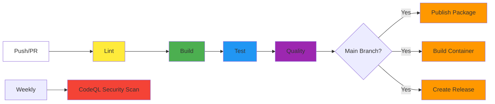

# GitHub Actions Workflows

CI/CD automation for this project.

---

## Overview

| Workflow | File | Purpose | Trigger |
|----------|------|---------|---------|
| **CI Build** | `ci-build.yml` | Lint, build, test, quality | Push/PR to main/develop |
| **CI Publish** | `ci-publish.yml` | Publish Maven package & container | Push to main |
| **CI Release** | `ci-release.yml` | Auto-create releases | Push to main |
| **CodeQL** | `codeql.yml` | Security scanning | Push/PR + Weekly |

---

## CI/CD Pipeline



### Jobs

| Job | Purpose |
|-----|---------|
| **Lint** | Validate OpenAPI with Spectral |
| **Build** | Maven compile & test |
| **Quality** | Checkstyle + SpotBugs |
| **Publish** | Upload JAR to GitHub Packages |
| **Container** | Build OCI image for AMD64/ARM64 |
| **Release** | Create GitHub release with changelog |
| **CodeQL** | Security vulnerability scan |

---

## Artifacts

| Type | Location |
|------|----------|
| Maven Package | `https://github.com/OWNER/REPO/packages` |
| Container | `ghcr.io/rizkirachman/goods-price-comparison-api:latest` |

---

## Workflow Badges

```markdown
[](https://github.com/RizkiRachman/goods-price-comparison-api/actions/workflows/ci.yml)
[](https://github.com/RizkiRachman/goods-price-comparison-api/actions/workflows/codeql.yml)
```

---

## Troubleshooting

| Problem | Solution |
|---------|----------|
| Maven build fails | `mvn clean compile -q` |
| Spectral lint fails | `spectral lint src/main/resources/openapi/main.yaml --ruleset .spectral.yaml` |
| SpotBugs issues | `mvn spotbugs:spotbugs && open target/spotbugsXml.xml` |

---

## Best Practices

### ✅ Do
- Use specific action versions (`@v4`, not `@master`)
- Cache dependencies for speed
- Add timeouts: `timeout-minutes: 30`
- Use minimal permissions

### ❌ Don't
- Hardcode credentials
- Use `latest` tags
- Store large files in artifacts

---

## Cost

All workflows are **FREE** for public repositories:
- Unlimited GitHub Actions minutes
- Unlimited artifact storage (public)
- Unlimited container image storage (public)

---

**See Also:** [CONTRIBUTING.md](../CONTRIBUTING.md)
