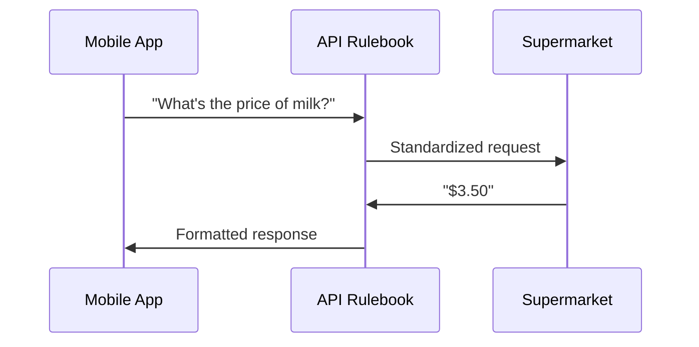
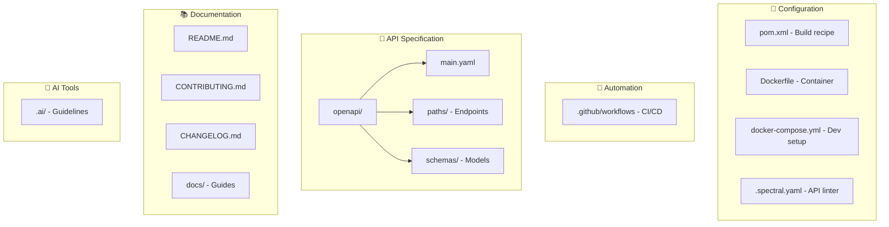

# Project Tour

A beginner-friendly guide to the Goods Price Comparison API project.

---

## What Is This Project?

This project creates the **API rulebook** that lets apps and supermarkets talk about grocery prices.

**Result:** A shared language that makes price comparison apps possible.

---

## Project Structure

---

## File Overview

| File                 | Purpose                   |
|----------------------|---------------------------|
| `pom.xml`            | Maven build configuration |
| `Dockerfile`         | Container packaging       |
| `.spectral.yaml`     | API linting rules         |
| `openapi/main.yaml`  | Main API specification    |
| `openapi/paths/`     | API endpoint definitions  |
| `openapi/schemas/`   | Data model definitions    |
| `.github/workflows/` | CI/CD automation          |
| `Makefile`           | Command shortcuts         |

---

## Workflow

### How Changes Flow

### Where to Edit

| What             | Where                    |
|------------------|--------------------------|
| Add endpoints    | `openapi/paths/*.yaml`   |
| Add data models  | `openapi/schemas/*.yaml` |
| Change API rules | `.spectral.yaml`         |

**Never edit generated code** - It's auto-regenerated on every build.

---

## Tools Explained

| Tool               | Purpose          | Analogy                 |
|--------------------|------------------|-------------------------|
| **Maven**          | Build & package  | General contractor      |
| **Spectral**       | Check API format | Grammar checker         |
| **GitHub Actions** | Auto-check code  | Quality inspector robot |
| **Docker/Podman**  | Run anywhere     | Shipping container      |
| **Git**            | Track changes    | Time machine            |

---

## Quick Reference

| Task            | Command             |
|-----------------|---------------------|
| Build           | `make build`        |
| Test            | `make test`         |
| Lint            | `make lint`         |
| Full check      | `make ci-check`     |
| Container build | `make podman-build` |

---

## Glossary

| Term          | Meaning                                  |
|---------------|------------------------------------------|
| **API**       | Rules for programs to talk to each other |
| **Endpoint**  | URL where requests are sent              |
| **DTO**       | Data package sent between programs       |
| **OpenAPI**   | Standard format for API specs            |
| **CI/CD**     | Automatic build, test, deploy            |
| **Container** | Package that runs anywhere               |
| **Linting**   | Checking code for format errors          |

---

**Need Help?** Contact: rizkifaizalr@gmail.com

*Last Updated: April 2026*
